# Information-Retrieval-From-Food-Journals using LLMs
 Text files inside data folder contains metadata from around 5000 journal articles within the food technology sector. Within this data, you will see variables such as 'authors', 'journal', 'year' and 'abstract'. 
 Task is to import this data, analyse it using your NLP skills, highlight any conclusions or findings you make and display such output on a dashboard. 

# Directory Structure

- [Information Retrieval From Food Journals.ipynb](./Information%20Retrieval%20From%20Food%20Journals.ipynb): Notebook contains code related to analysis.
- [presentation_information_retrieval.pdf](./presentation_information_retrieval.pdf): A presentation about the analysis
- [charts](./Charts): Contains all the charts that were drawn on this project.
- [data](./data): Contains all the data files which are getting analyzed.

# Following are few insights that i have fetched form data-

# Abstract Basic Stats

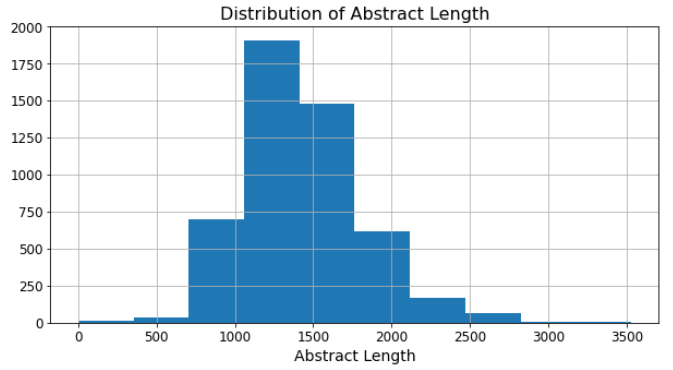

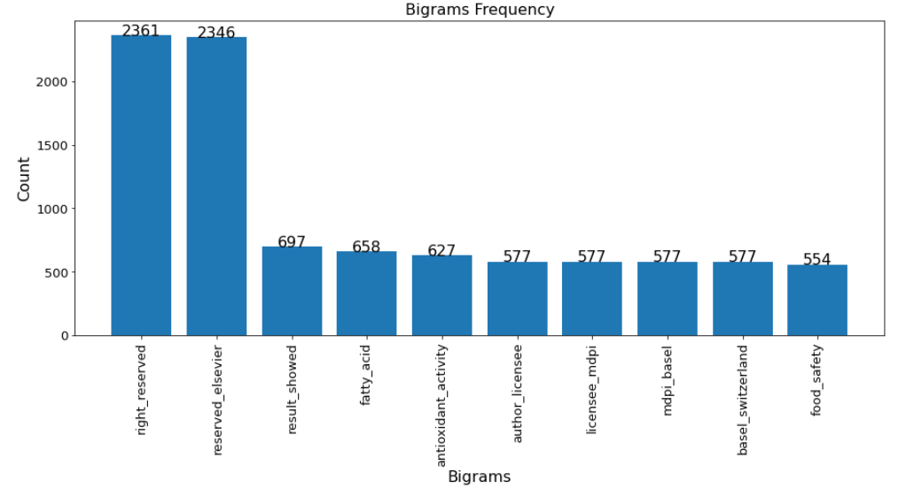

# Most frequent noun Phrases in abstract
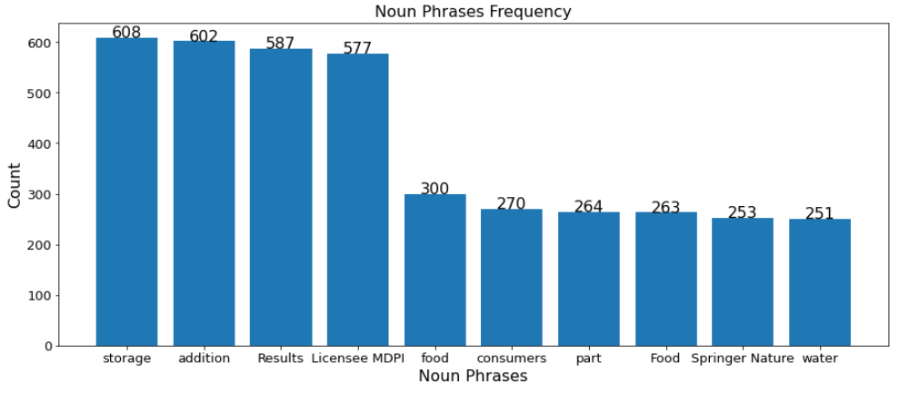

# Sentiment Ansysis on abstract
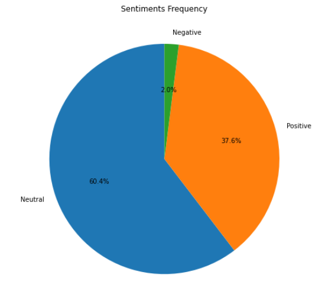

# Topic Modelling Usin LDA

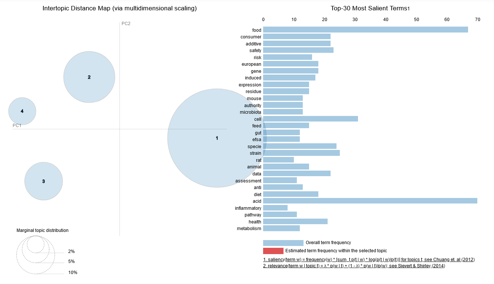

# Top Keywords according to LDA
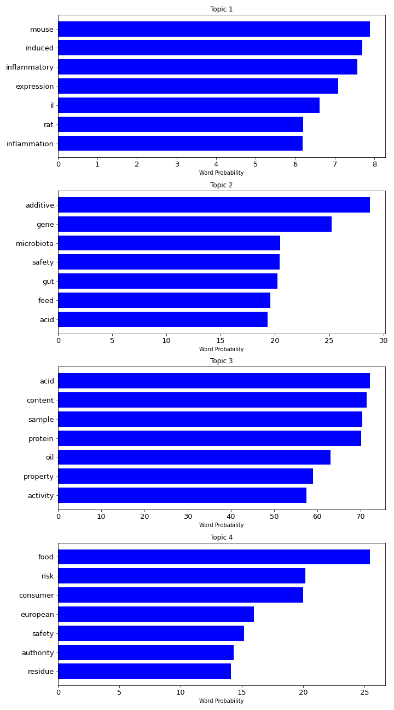

# Topic Modelling Usin BERTopic
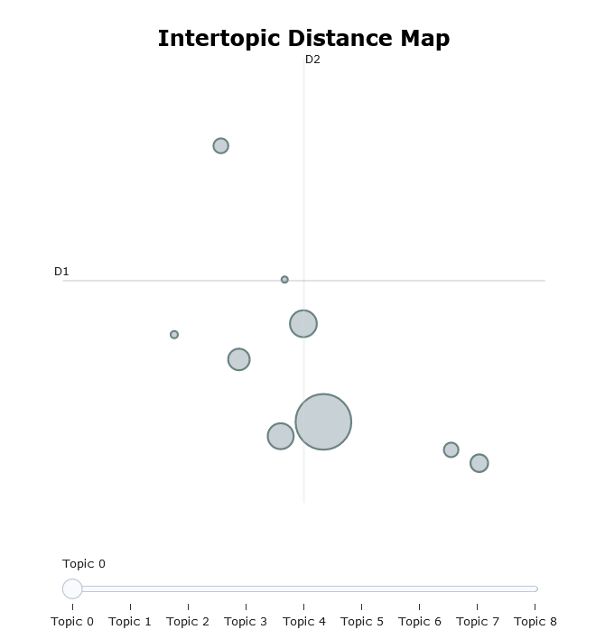
# Top Keywords according to BERTopic
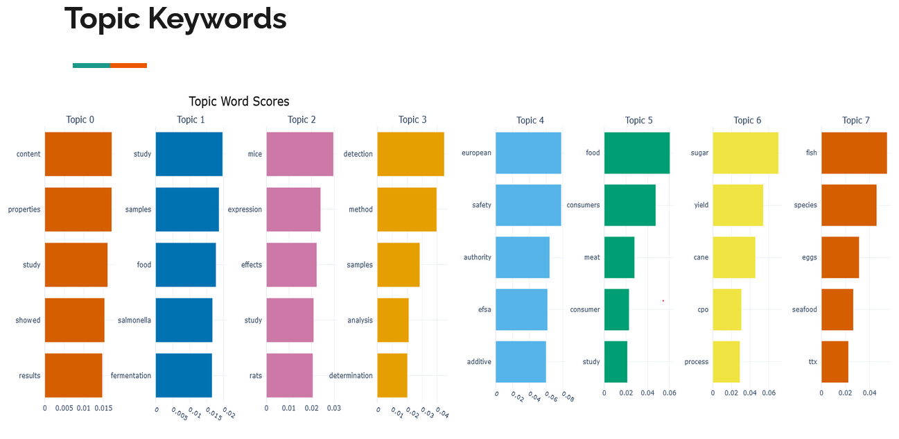
# Similarity between topics
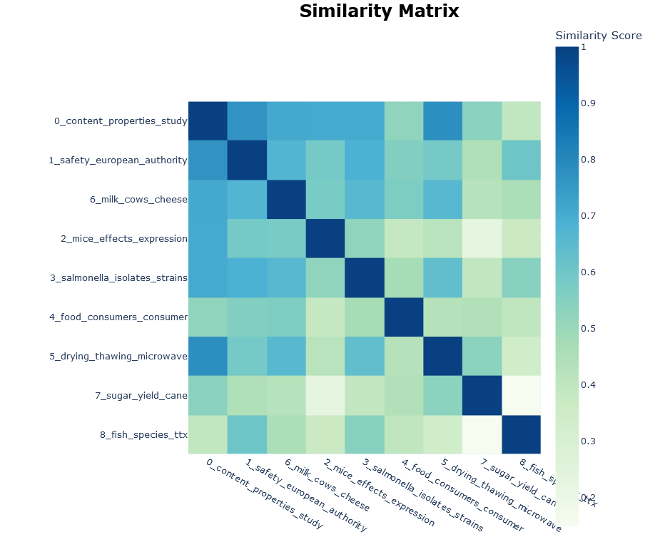
# Topic's trend over time
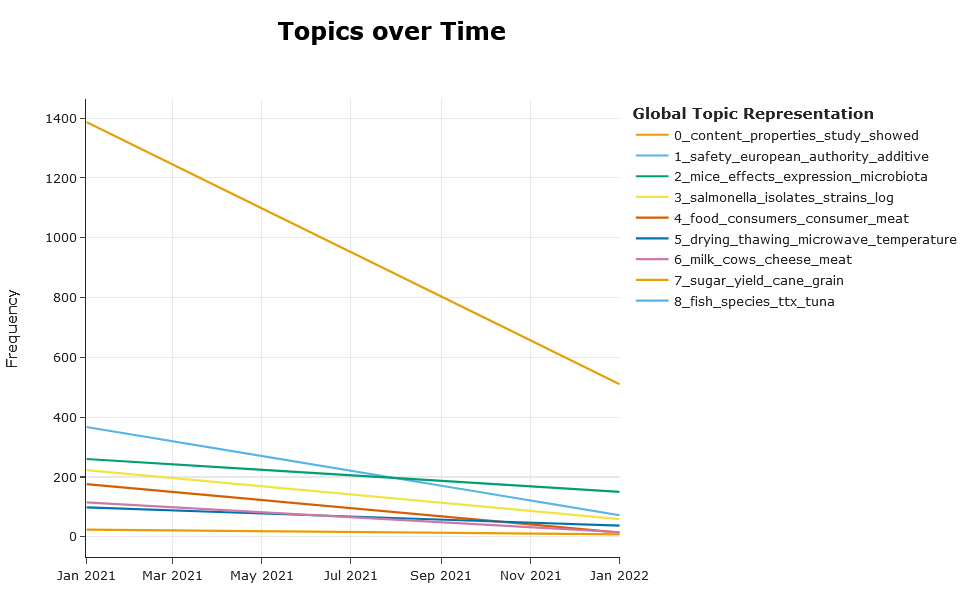

# Populer chamical componds being discussed
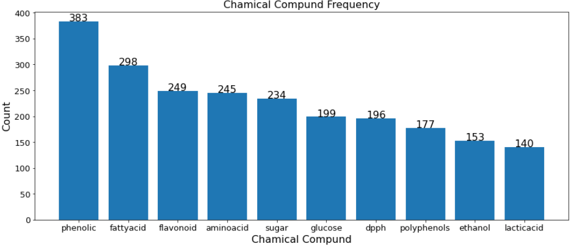

# Populer food items being discussed
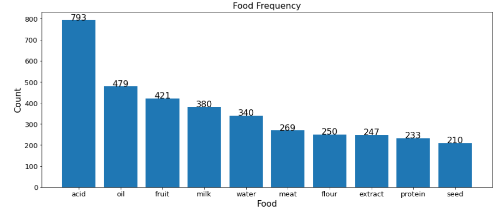

# Top 10 Authors
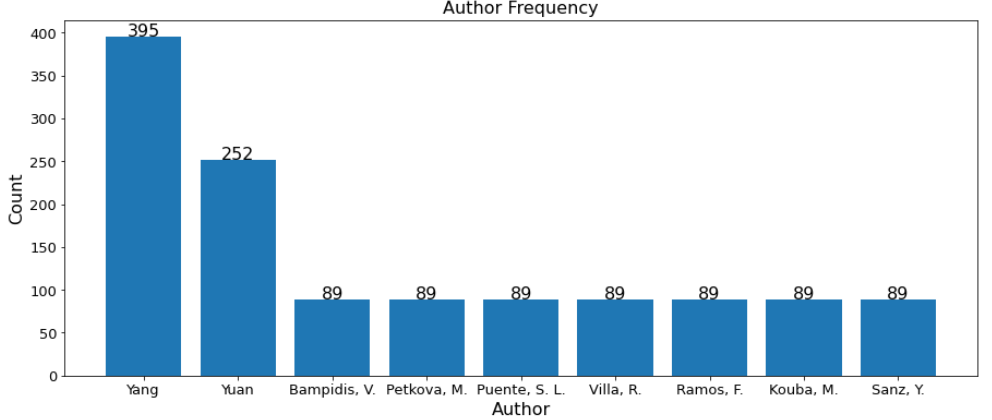

# Top 10 Journals
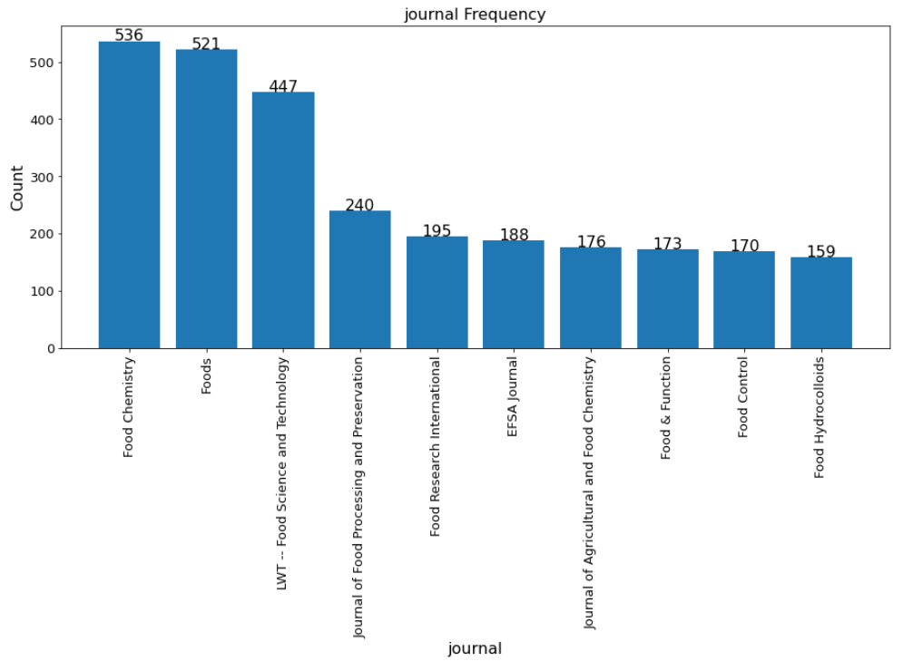

# Top 10 Collaborations
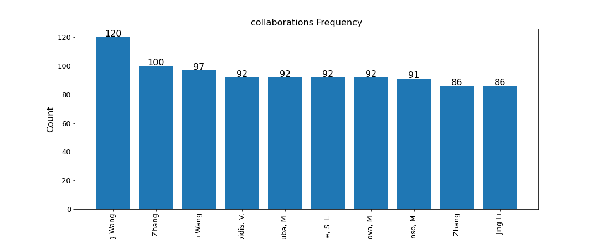
