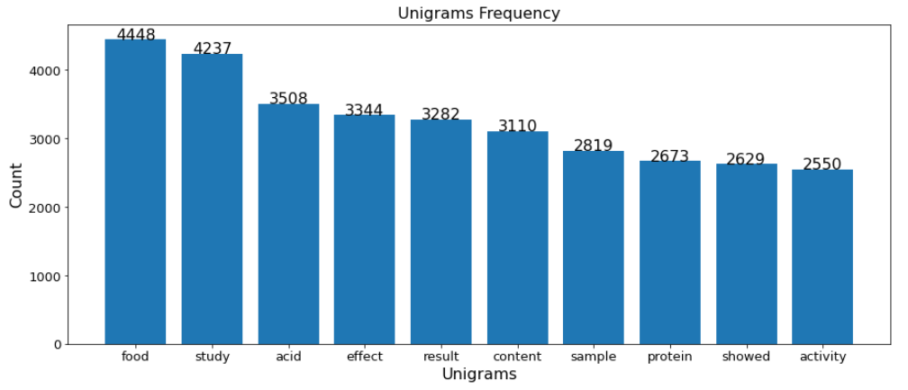

# Information-Retrieval-From-Food-Journals
 Text files inside data folder contains metadata from around 5000 journal articles within the food technology sector. Within this data, you will see variables such as 'authors', 'journal', 'year' and 'abstract'. 
 Task is to import this data, analyse it using your NLP skills, highlight any conclusions or findings you make and display such output on a dashboard. 

 Following are few insights that i have fetched form data-

